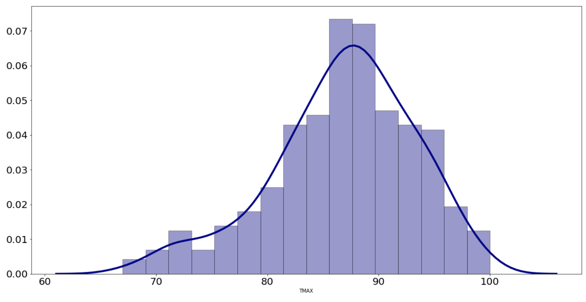

# weather-distributions
This was a personal project using Pandas, Numpy, Matplotlib, and Seaborn to get more than just the max, min, and mean of temperatures for the sake of letting me make better decisions about when to plan vacations and other outdoor events.

Given historical weather data, such as can be found at [https://www.ncdc.noaa.gov/cdo-web/datatools/findstation](https://www.ncdc.noaa.gov/cdo-web/datatools/findstation), the code in the weather.ipynb notebook computes quantiles for both daily highs and lows for a given week.  It also produces histogram plots for highs for that week.  The code can be easiliy modified to generate plots for low temperatures or to compute quantiles and histograms for different time scales.

An example of the histogram is given below.

Using that, you can see the propensity for different high temperatures for a given week.